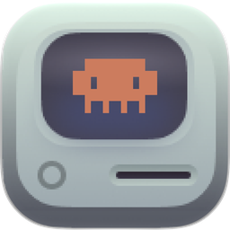
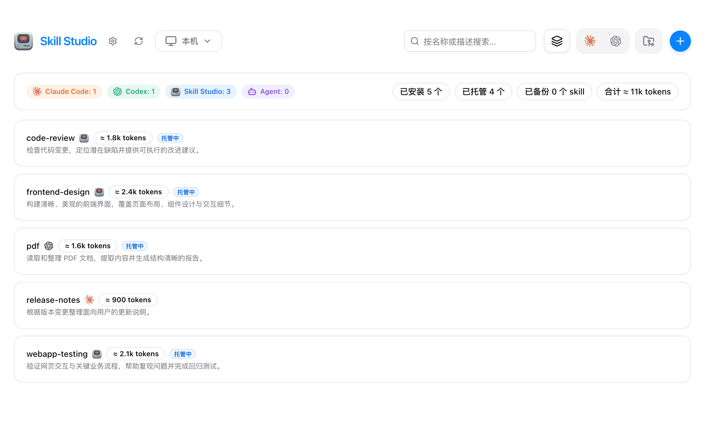
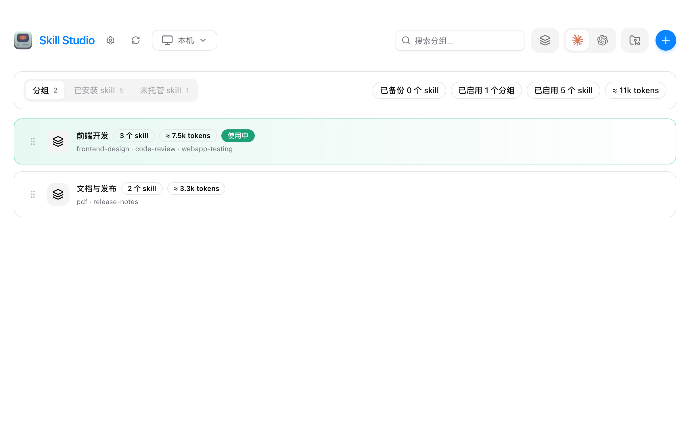
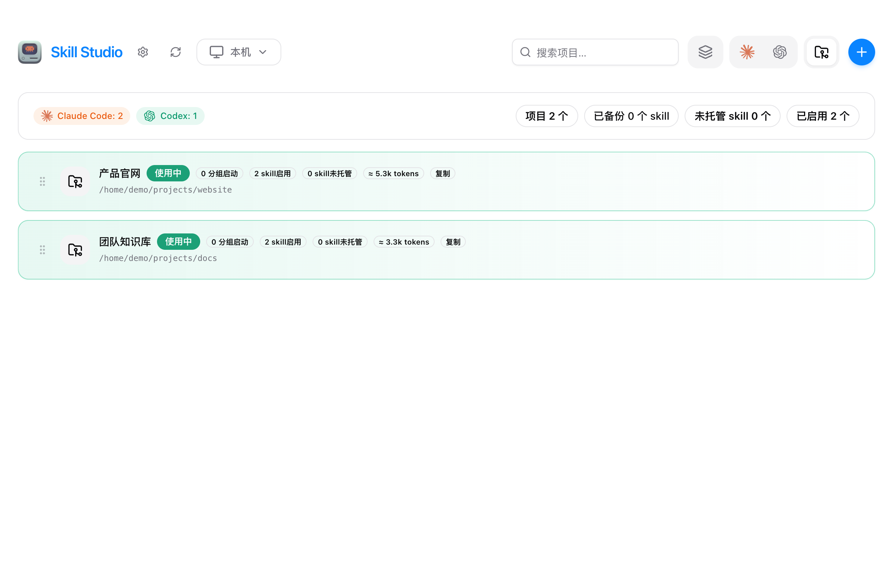

<p align="center">
  
</p>

<h1 align="center">Skill Studio</h1>

<p align="center">集中管理 Claude Code 和 Codex 的 Skills，从本机到远程 Linux 服务器。</p>

<p align="center">
  <a href="https://github.com/tarnish233/skill-studio/releases/latest">下载安装</a> ·
  <a href="CHANGELOG.md">更新日志</a> ·
  <a href="https://github.com/tarnish233/skill-studio/issues">反馈问题</a>
</p>

## 安装

### macOS

支持 Apple Silicon 和 Intel，需 macOS 12 或更高版本。

```sh
brew install --cask tarnish233/tap/skill-studio
```

也可以下载 `.dmg`，打开后将 Skill Studio 拖入「应用程序」。

### Windows / Linux

前往 [最新版本](https://github.com/tarnish233/skill-studio/releases/latest) 下载安装包：

| 系统 | 安装包 |
| --- | --- |
| Windows x64 | `.exe` 或 `.msi` |
| Linux x64 | `.AppImage` 或 `.deb` |

AppImage 需先在文件属性中允许作为程序执行，再双击打开。

## 功能

- **Skill Hub**：集中查看、搜索和托管 Skills，预览内容与 Token 估算；支持在线搜索安装和本地目录导入。
- **MCP Hub**：自动扫描 Claude／Codex 配置，支持表单、JSON／TOML 和模板添加，一次同步多个 Agent；直连管理与共享授权网关可独立使用。[使用说明](docs/mcp.md)
- **Agent 管理**：为 Claude Code、Codex 配置 Skills，按使用场景分组，一键启用或停用。
- **项目配置**：为每个项目选择 Agent 和 Skills，让不同项目使用各自的配置。
- **远程服务器**：读取 SSH config，选择 Linux 服务器后管理它的 Skills、分组、项目与备份，支持密钥、密码和跳板机连接。
- **备份与恢复**：支持配置备份和已删除 Skill 的恢复；提供浅色、深色与跟随系统外观。

## 界面预览

以下为当前界面的示例数据截图。

**Skill Hub · 集中查看与托管**



**Agent · 按场景组织分组**



**项目 · 独立配置 Skills**



## 开始使用

1. 打开应用，在 Hub 查看已有 Skills，或点击右上角 `+` 安装、导入。
2. 进入 Claude Code 或 Codex 页面，创建并启用需要的分组。
3. 需要项目配置时，进入「项目」添加目录，选择 Skills 后保存并写入。

远程管理可在「设置 → 服务器」中启用并添加连接。切换到服务器后，Skills、项目、目录和备份均属于该服务器；切回「本机」即可继续本地管理。

## 许可证

[MIT License](LICENSE) © 2026 tarnish233
